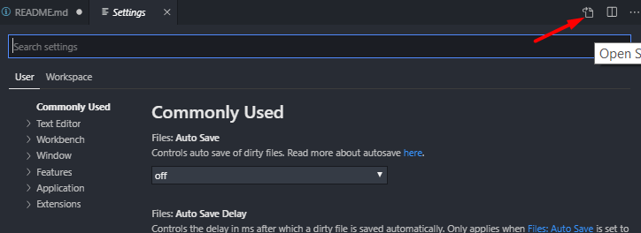

# .vscode

> Contains Justin's VSCode settings to support either Salesforce DX, Node, or Vue JS Development.

## /snippets

> Contains an apex.json snippet for creating apex test classes and methods.

```
# To access your snippets in VSCode
1. Open Command Pallette (CTRL + SHIFT + P )
2. Key-in: "Preferences: Configure User Snippets"
3. Key-in: "Apex"
```

Once opened, you can copy/paste the snippets here.

[VSCode Snippets](https://code.visualstudio.com/docs/editor/userdefinedsnippets).

## /extensions.md

> A full list of installed extensions

## VSCode Settings

> How to access your settings in vscode [here](https://code.visualstudio.com/docs/getstarted/settings).

Open the Command Pallette: `ctrl + shift + p`

Enter: `User Settings`

This will provide a UI interface to manage settings, additionally the file can be edited directly in JSON by clicking the Open Settings (JSON) button pictured below.



### /settings/user.json

User Settings JSON File for vscode. Includes language specific indentation settings. Applies to all of your projects.

### /settings/sfdx-workspace.json

Workspace settings JSON for an SFDX project.

### /settings/sfdx-manifest-workspace.json

Workspace settings JSON for an SFDX traditional org model project.

### /settings/vue-workspace.json

Workspace settings JSON for vscode. Includes Vue JS Specific settings. Unique to the working directory.

## LWC ESLint Settings

Enforces standard Javascript formatting in Lightning Web Components.

Copy .eslintrc.json to `force-app/main/default/lwc`
